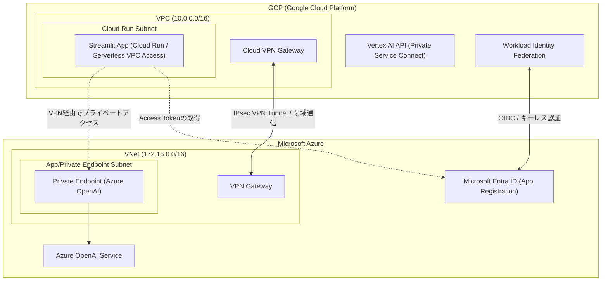

# Multi-Cloud Secure AI Network & DLP Dashboard 🛡️

マルチクラウド（Azure & GCP）環境におけるセキュアな生成AI利用を目的とした、ネットワーク設計、キーレス認証、およびデータ流出防止（DLP）の実証デモアプリケーションです。

---

## 🚀 ポートフォリオとしてのアピールポイント（履歴書向け）

本リポジトリは、マルチクラウドのネットワーク、セキュリティ、およびAIインテグレーションの実践力を証明するためのポートフォリオです。以下の技術スキルを実証しています。

1. **マルチクラウド閉域ネットワーク設計（IaC）**:
   - GCP VPC と Azure VNet 間を **IPsec VPN** で相互接続するインフラ設計。
   - Azure OpenAI に対する **Private Endpoint**（プライベートエンドポイント）の敷設とプライベートDNSによる名前解決。
   - 上記すべてを **Terraform (IaC)** によりコード化し、再現可能なインフラ構成を保証。

2. **静的APIキーを排除したキーレス認証**:
   - GCP のサービスアカウントと Azure Entra ID アプリケーション間で **Workload Identity Federation / OIDC** 連携を設定。
   - 環境変数に固定のAPI秘密鍵を持たせず、一時的なトークン交換によって安全にクラウド間のAPI認可を実行する設計。

3. **水際でのデータ流出防止 (DLP)**:
   - **Microsoft Presidio** を活用した、日本語および機密情報（電話番号、メール、マイナンバー、APIキーなど）のローカル検知・マスキングエンジンを Python で実装。
   - 送信データに含まれる機密情報を自動マスキングした上でAIに送信するデータガバナンスの仕組み。

4. **採用担当者が即座に確認できる「シミュレーションモード」**:
   - 実際のクラウド環境を起動（課金が発生）させなくても、ローカル環境でDLPの動作やネットワーク設計情報の確認ができるモックモードを搭載。

---

## 🌐 システム構成図



---

## 📂 プロジェクト構成

```text
├── app/
│   ├── app.py             # Streamlit ダッシュボード & チャット UI
│   ├── dlp.py             # Microsoft Presidio を用いたDLPマスキングモジュール
│   ├── ai_client.py       # Azure OpenAI / GCP Vertex AI クライアント（モック機能付き）
│   └── requirements.txt   # 依存関係定義ファイル
├── terraform/
│   ├── variables.tf       # 共通変数定義
│   ├── gcp/
│   │   └── main.tf        # VPC, Cloud VPN, WIF, Cloud Run 構築定義
│   └── azure/
│       └── main.tf        # VNet, VPN Gateway, Azure OpenAI, PE 構築定義
├── docs/
│   └── comparison_and_design.md  # 3つのセキュリティ境界モデルの技術比較と設計解説
└── README.md              # プロジェクト概要（本ファイル）
```

## 📧 メール返信型 承認自動化フロー (Mail Approval Flow)

本システムには、安全な運用ゲートキーパーとして、特定の重要処理（例: Terraformの適用）を実行する前に承認者にメールを送信し、その返信（`APPROVE` または `承認`）をトリガーに自動実行する仕組みが組み込まれています。

### 1. 承認用 CLI ラッパー
任意のシェルコマンドをメール承認後に実行するための汎用ラッパーです：
```bash
./run_with_approval.sh "<タスク名>" "<実行するコマンド>" [追加オプション...]
```
- **承認者宛先**: デフォルトで `makoto.insidesales@gmail.com` に送信されます。

### 2. Terraform デプロイ連携スクリプト (`deploy_with_approval.sh`)
Terraform の変更計画 (plan) を実行し、変更差分をメール本文に含めて承認者に送信します。承認が得られた段階で `terraform apply` を安全に自動実行します。
```bash
# シミュレーションモード（メール送信なしで、コンソール上で承認・却下を模擬）
./deploy_with_approval.sh --cloud azure --simulate

# 本番動作（メールを実際に送信し、返信を受信するまでバックグラウンドでポーリング）
./deploy_with_approval.sh --cloud azure
```

### 3. メール送受信の設定 (`.env` ファイルの作成)
実際のメール送信・受信ポーリングを行うには、プロジェクトのルートディレクトリに `.env` ファイルを作成し、以下のボット送信元アカウントを設定してください：
```env
# ボットのメールアドレス設定（Gmailの場合はアプリパスワードが必要です）
SENDER_EMAIL=your-bot-email@gmail.com
SENDER_PASSWORD=your-gmail-app-password

# 承認者のメールアドレス
APPROVER_EMAIL=makoto.insidesales@gmail.com
```

---

## 🛠️ クイックスタート（ローカルデモ起動手順）

クラウド環境をデプロイせずに、ローカル環境でDLPのマスキング機能やモック応答の動作を確認できます。

### 1. 依存ライブラリのインストール

```bash
# 必要なライブラリのインストール
pip install -r app/requirements.txt

# Microsoft Presidio用NLPモデルのダウンロード (約12MB)
python -m spacy download en_core_web_sm
```

### 2. デモアプリの起動

```bash
streamlit run app/app.py
```

起動後、自動的にブラウザが開きます（デフォルト: `http://localhost:8501`）。

### 3. デモの確認手順
1. 左側のサイドバーで**「シミュレーション（モックモード）」**が選択されていることを確認します。
2. チャットの入力欄に、個人情報やAPIキーを含むテキストを入力します。
   - *入力例: 「佐藤さんの電話番号は 090-1234-5678 です。Azureのキーは AIzaSy... です。」*
3. **「セキュア送信」** をクリックします。
4. 画面右側の **「リアルタイム DLP 監査ログ」** にて、生データとマスキング後（`[PHONE_NUMBER]`などに置換されたデータ）の比較、および検出されたエンティティの詳細が美しく表示されます。
5. チャット欄には、マスキング済みの安全なデータを使ってAIが応答したシミュレーションメッセージが返却されます。
