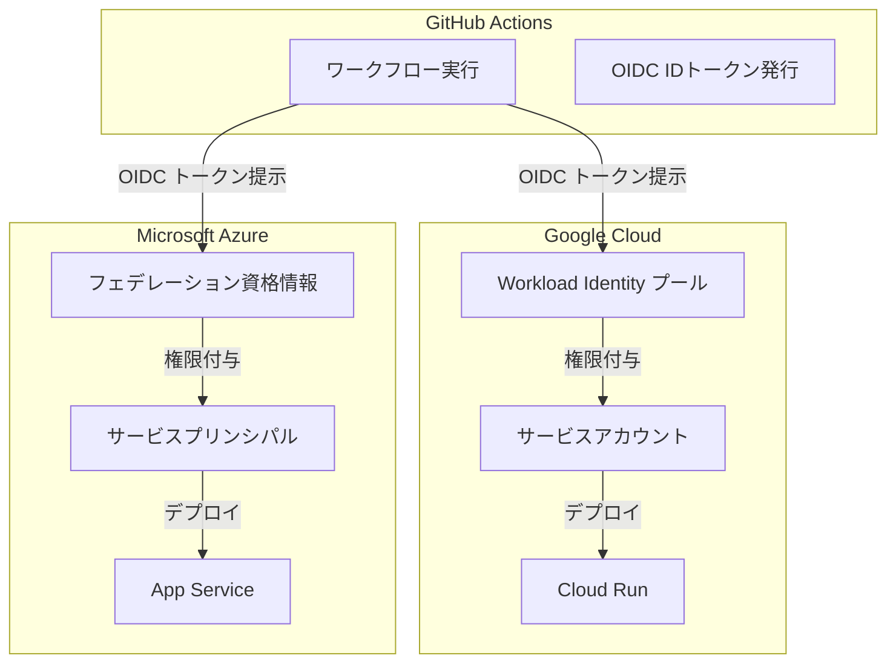

# マルチクラウドキーレス認証標準化 PoC 設計書

本設計書は、GitHub Actions から Google Cloud（Cloud Run）および Azure（Azure App Service）に対して、安全にデプロイを行うための「キーレス認証」の検証（PoC）計画です。

---

## 1. 背景と目的

### 従来の認証方法の課題
これまで、GitHub Actions などの外部サービスから各クラウド（Google Cloud や Azure）にアクセスする際は、**「サービスアカウントキー（秘密鍵）」**や**「サービスプリンシパル（クライアントシークレット）」**といった「静的な鍵（パスワードのようなもの）」を GitHub の Secrets に保存して使用していました。
しかし、この方法には以下の重大なリスクがあります。
- **鍵の漏洩リスク**: GitHub から鍵が漏洩した場合、クラウド全体が不正アクセスの脅威に晒されます。
- **管理の負担**: 定期的に鍵を更新（ローテーション）する運用の手間が発生します。

### キーレス認証による解決
本 PoC では、**OIDC (OpenID Connect)** という標準規格を利用した**「キーレス認証（Workload Identity Federation / Federated Credentials）」**を導入します。
静的な鍵を一切発行せず、GitHub Actions が実行されるたびに、その実行を証明する「使い捨てのトークン」を発行し、各クラウドがそれを検証してアクセスを許可します。

---

## 2. 対象システムと構成

本 PoC で検証する対象と利用するサービスは以下の通りです。



| コンポーネント | 役割 / サービス | 認証方式 |
| :--- | :--- | :--- |
| **ID プロバイダ** | GitHub Actions | OIDC トークン (JWT) の発行元 |
| **Google Cloud** | Cloud Run (コンテナ実行環境) | Workload Identity Federation (WIF) |
| **Azure** | App Service (Webアプリ実行環境) | アプリ登録とフェデレーション資格情報 |

---

## 3. Google Cloud キーレス認証設定案 (Workload Identity Federation)

GitHub Actions から Google Cloud にアクセスするための設定手順です。

### 構成要素の説明
- **Workload Identity プール (Pool)**: 外部の ID プロバイダ（ここでは GitHub）からの接続をグループ化して管理する論理的なコンテナです。
- **Workload Identity プロバイダ (Provider)**: GitHub Actions の信頼設定（どのリポジトリからの接続を許可するか等）を定義する場所です。
- **サービスアカウント**: Google Cloud 内の操作権限を持つ仮想ユーザーです。GitHub Actions はプロバイダ経由でこのアカウントになりすまします。

### 設定ステップ
1. **WIF プールの作成**:
   ```bash
   gcloud iam workload-identity-pools create "github-pool" \
     --location="global" \
     --display-name="GitHub Actions Pool"
   ```
2. **WIF プロバイダの作成** (GitHub への信頼設定):
   ```bash
   gcloud iam workload-identity-pools providers create-oidc "github-provider" \
     --workload-identity-pool="github-pool" \
     --location="global" \
     --issuer-uri="https://token.actions.githubusercontent.com" \
     --attribute-mapping="google.subject=assertion.sub,attribute.repository=assertion.repository"
   ```
3. **サービスアカウントの作成**:
   ```bash
   gcloud iam service-accounts create "github-actions-sa" \
     --display-name="GitHub Actions Deploy SA"
   ```
4. **サービスアカウントとプロバイダのバインド**:
   特定の GitHub リポジトリ（例: `manchinsanshinsales/secure-ai-network`）からのみ、サービスアカウントになりすませる（Impersonation）ように制限します。
   ```bash
   gcloud iam service-accounts add-iam-policy-binding "github-actions-sa@${PROJECT_ID}.iam.gserviceaccount.com" \
     --role="roles/iam.workloadIdentityUser" \
     --member="principalSet://iam.googleapis.com/projects/${PROJECT_NUMBER}/locations/global/workloadIdentityPools/github-pool/attribute.repository/manchinsanshinsales/secure-ai-network"
   ```
5. **権限付与**:
   作成したサービスアカウントに対し、Cloud Run にデプロイできる最小限の権限（`roles/run.admin` および `roles/iam.serviceAccountUser`）を付与します。

---

## 4. Azure キーレス認証設定案 (Federated Credentials)

GitHub Actions から Azure にアクセスするための設定手順です。

### 構成要素の説明
- **アプリ登録 (App Registration)**: Azure AD（Microsoft Entra ID）に登録するアプリケーションです。
- **フェデレーション資格情報 (Federated Credentials)**: 外部の ID プロバイダ（GitHub）と Azure AD のアプリ登録を信頼関係で結ぶ設定です。

### 設定ステップ
1. **Microsoft Entra ID でのアプリ登録（サービスプリンシパル）の作成**:
   Azure ポータルまたは Azure CLI でアプリを登録します。
2. **フェデレーション資格情報の追加**:
   登録したアプリに対して、以下の信頼設定を追加します。
   - **Issuer**: `https://token.actions.githubusercontent.com`
   - **Subject identifier**: `repo:manchinsanshinsales/secure-ai-network:ref:refs/heads/main` （特定リポジトリの main ブランチのみ許可）
   - **Audience**: `api://AzureADTokenExchange`
3. **サブスクリプション権限の付与**:
   アプリ登録（サービスプリンシパル）に対し、Azure App Service にデプロイするためのロール（「共同作成者」など）をリソースグループ単位で付与します。

---

## 5. GitHub Actions ワークフロー設計案

OIDC 認証を利用したデプロイワークフローの基本骨子です。
重要なポイントとして、認証トークンを発行するための権限 `permissions.id-token: write` を明示的に設定する必要があります。

```yaml
name: Secure Multi-Cloud Deployment

on:
  push:
    branches:
      - main

permissions:
  id-token: write # OIDC トークンを取得するために必須
  contents: read

jobs:
  deploy-to-gcp:
    runs-on: ubuntu-latest
    steps:
      - name: Checkout code
        uses: actions/checkout@v4

      # 1. Google Cloud へのキーレス認証
      - name: Authenticate to Google Cloud
        uses: google-github-actions/auth@v2
        with:
          workload_identity_provider: 'projects/${{ secrets.GCP_PROJECT_NUMBER }}/locations/global/workloadIdentityPools/github-pool/providers/github-provider'
          service_account: 'github-actions-sa@${{ secrets.GCP_PROJECT_ID }}.iam.gserviceaccount.com'

      # 2. Cloud Run へのデプロイ
      - name: Deploy to Cloud Run
        uses: google-github-actions/deploy-cloudrun@v2
        with:
          service: 'my-secure-service'
          region: 'asia-northeast1'
          source: './'

  deploy-to-azure:
    runs-on: ubuntu-latest
    steps:
      - name: Checkout code
        uses: actions/checkout@v4

      # 1. Azure へのキーレス認証
      - name: Log in to Azure
        uses: azure/login@v2
        with:
          client-id: ${{ secrets.AZURE_CLIENT_ID }}
          tenant-id: ${{ secrets.AZURE_TENANT_ID }}
          subscription-id: ${{ secrets.AZURE_SUBSCRIPTION_ID }}

      # 2. App Service へのデプロイ
      - name: Deploy to Azure Web App
        uses: azure/webapps-deploy@v3
        with:
          app-name: 'my-secure-azure-app'
          package: './'
```

---

## 6. 今後の検証（PoC）ステップ

1. **第1段階：環境構築と Google Cloud の検証**
   - Google Cloud 上で Workload Identity の設定を terraform または CLI で実行
   - テスト用の Cloud Run サービスを作成し、キーレスでのデプロイが成功するか確認
2. **第2段階：Azure の検証**
   - Entra ID 上でアプリ登録とフェデレーション資格情報を設定
   - テスト用の App Service を作成し、キーレスでのデプロイが成功するか確認
3. **第3段階：マルチクラウド統合と自動化**
   - 1つのリポジトリから両方のクラウド環境への自動デプロイパイプライン（GitHub Actions）を統合完成させる
