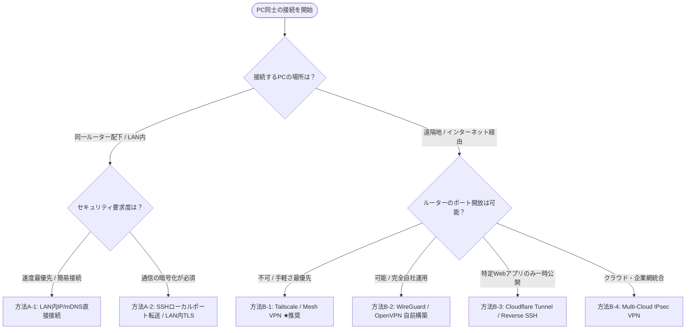

# PC間セキュア接続 比較・選定基準 & 通信ガイドライン

本ドキュメントでは、PC同士を接続する際の通信ネットワーク環境（**同一ルーター配下：LAN通信** vs **遠隔地：WAN通信**）に応じた接続方法、比較、および選定基準を整理します。

---

## 🧭 接続方式の選定フローチャート



---

## 📊 総合比較・選定基準マトリクス

| 接続方式 | ネットワーク環境 | ルーター設定 (ポート開放) | 設定難易度 | 通信速度 | セキュリティ強度 | 主なユースケース |
| :--- | :--- | :--- | :--- | :--- | :--- | :--- |
| **A-1. LAN内 IP/mDNS直接接続** | 同一ルーター内 | **不要** | ★☆☆ (極小) | ★★ (LAN限界速度) | ★☆☆ (生データ) | 同一オフィスのPC間デバッグ |
| **A-2. SSHローカルポート転送** | 同一ルーター内 | **不要** | ★★☆ (低) | ★★★ (高速) | ★★☆ (SSH暗号化) | 同一LAN内で安全な開発ポートアクセス |
| **B-1. Tailscale (Mesh VPN)** | 遠隔地 / WAN | **不要** (NAT自動越え) | ★☆☆ (数分) | ★★★ (直接P2P) | ★★★ (WireGuard+SSO) | **【推奨】** どこからでも安全接続 |
| **B-2. WireGuard (自前構築)** | 遠隔地 / WAN | 要 (ポートフォワード) | ★★★ (中〜高) | ★★★ (直接P2P) | ★★★ (鍵認証) | 完全自前サーバーへの固定トンネル |
| **B-3. Cloudflare Tunnel / Reverse SSH**| 遠隔地 / WAN | **不要** | ★★☆ (中) | ★★☆ (中継あり) | ★★☆ (HTTPS / SSH) | ポート非開放での一時Webアプリ共有 |
| **B-4. Multi-Cloud IPsec VPN** | 遠隔地 / クラウド | **不要** (クラウド側構築) | ★★★★ (高) | ★★☆ (クラウド経由) | ★★★★ (企業級) | GCP/Azure連携・拠点間網統合 |

---

## 💻 接続方法の詳細解説

---

### シナリオ A：同じルーター配下で通信する方法（同一LAN通信）

同じWi-Fiやルーターに接続されているPC同士は、インターネットを経由せず直接通信が可能です。

#### 方法 A-1: LAN内 プライベートIP / mDNS 直接指定
* **仕組み**: ルーターから割り当てられたローカルIP（`192.168.x.x` や `10.x.x.x`）またはホスト名（`pc-name.local`）を使って接続します。
* **手順**:
  1. 接続先PCのIPを確認（Windows: `ipconfig`, Linux/Mac: `hostname -I`）。
  2. 接続先PCのOSファイアウォールで通信ポート（例: 8501, 8000）を許可。
  3. 接続元PCから `http://192.168.1.50:8501` または `http://my-pc.local:8501` にアクセス。
* **メリット**: ポート開放や外部サービス不要。ギガビットLAN通信で超高速。
* **注意点**: ルーターの再起動等でIPが変わる場合は、固定IP化かmDNS (`.local`) の利用を推奨。

#### 方法 A-2: SSHローカルポート転送（LAN内暗号化トンネル）
* **仕組み**: LAN内であっても平文通信を避けたい場合、SSHトンネル（`ssh -L`）を通して安全にポートを暗号化転送します。
* **コマンド例**:
  ```bash
  # 接続元PCから実行（接続先PCの8501ポートを、ローカルの8501として転送）
  ssh -L 8501:localhost:8501 user@192.168.1.50
  ```
* **メリット**: 通信がすべてSSHで暗号化され、盗聴を防止可能。

---

### シナリオ B：遠隔地から通信する方法（インターネット経由 / WAN通信）

自宅とオフィス、あるいは出先ノートPCと自宅PCなど、異なるルーター配下にいるPC同士を接続します。

#### 方法 B-1: Tailscale / ZeroTrust Mesh VPN ★【推奨】
* **仕組み**: WireGuard をベースにした次世代P2P VPN。両方のPCにアプリを入れ、同じアカウントでログインするだけで仮想閉域網を構築。
* **特徴**:
  * NAT（ルーター）を自動で通り抜けるため、ルーターのポート開放設定が**一切不要**。
  * 各PCに固定VPN IP (`100.x.y.z`) が付与され、遠隔地からでも `http://100.115.x.y:8501` で直接アクセス。
* **セキュリティ**: 通信はすべてエンドツーエンド暗号化 (ChaCha20-Poly1305)。

#### 方法 B-2: WireGuard (自前構築 VPN)
* **仕組み**: 自前で WireGuard サーバーを立て、クライアントPCから直接暗号化トンネルを接続。
* **条件**: 受信側ルーターで UDP ポート（例: 51820）のポートフォワーディング設定が必要。

#### 方法 B-3: Cloudflare Tunnel / Reverse SSH トンネル
* **仕組み**: ポート開放ができない環境で、外部の中継サーバー（CloudflareやVPS）を経由して安全にHTTP/HTTPS通信を引き込む。
* **特徴**: WebブラウザからURL（例: `https://my-app.trycloudflare.com`）で安全にアクセス可能。

#### 方法 B-4: クラウド経由 IPsec VPN (secure-ai-network 方式)
* **仕組み**: Azure Virtual Network Gateway や GCP Cloud VPN などをハブとし、拠点間・PC間を IPsec トンネルで結ぶ。企業インフラ向け。

---

## 🎯 最終選定基準のまとめ

1. **同室・同一オフィス内での開発・デバッグ**
   👉 **`方法 A-1 (LAN直結)`** または **`方法 A-2 (SSHトンネル)`** が最速かつ設定最小。
2. **遠隔地からの安全なアクセス（個人・チーム開発）**
   👉 **`方法 B-1 (Tailscale)`** がセキュリティ・速度・設定の易しさにおいて最も優れておりベストチョイス。
3. **完全自社管理・クラウド連携の本格運用**
   👉 **`方法 B-4 (Multi-Cloud IPsec VPN)`** を採用。
